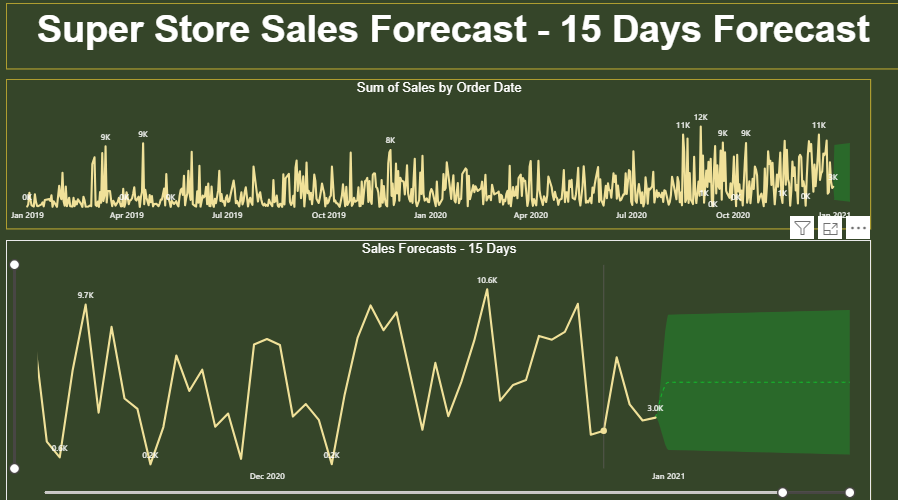

# 📊 Super Store Sales Dashboard & Forecasting

This project contains two interactive dashboards built using **Power BI** that analyze and forecast sales data for a fictional superstore. It demonstrates data analysis, business insights, and time series forecasting.

## 🔹 Project Overview

### 1. **Sales Dashboard**
This dashboard provides a high-level overview of:
- 🛒 **Total Sales:** $1.6M  
- 📦 **Quantity Sold:** 22K  
- 💰 **Profit:** $175K  
- 🚚 **Average Delivery Days:** 4  
- 📊 Breakdowns by: Segment, Category, Subcategory, State, Payment Mode, Ship Mode

### 2. **Sales Forecast Dashboard**
This report provides a **15-day forecast** of daily sales using Power BI's built-in forecasting tools.
- Shows trends and seasonality from Jan 2019 to Jan 2021
- Predicts future sales patterns with confidence intervals

---

## 🛠 Tools Used
- **Power BI** – For data modeling, visualization, and forecasting
- **DAX (Data Analysis Expressions)** – For calculated columns and measures
- **Power Query** – For data cleaning and transformation
- **Time Series Forecasting** – Using built-in analytics features in Power BI

---

## 📷 Dashboard Snapshots

### 🔹 Sales Performance Dashboard

### 🔹 Sales Forecasting Dashboard

---

## 🎯 Key Insights
- The **Consumer segment** is the highest contributor (48%).
- **Standard Class** shipping is the most used mode.
- Top subcategories by sales include **Phones** and **Chairs**.
- Sales show a seasonal trend with spikes during holiday periods.
- Future sales expected to stay consistent with slight growth.

---

## 💼 About Me

I'm a passionate data enthusiast aiming for opportunities in the field of **data analysis**. This project is a showcase of my capabilities in using Power BI for delivering real business insights.

🔗 [Connect with me on LinkedIn](https://www.linkedin.com/in/chandan-shakya-0580a0209/)

---

## 📁 How to Use
1. Clone this repository or download the `.pbix` files (optional).
2. Open in Power BI Desktop to explore the interactive dashboards.
3. Filter by region, segment, or time period to dig deeper.

---

## 📌 Contact

Feel free to connect with me for collaboration or job opportunities:

📧 Email: [your.email@example.com]  
📍 Location: [Gwalior,India]

---

**⭐ If you like this project, please star the repository and share your feedback!**
